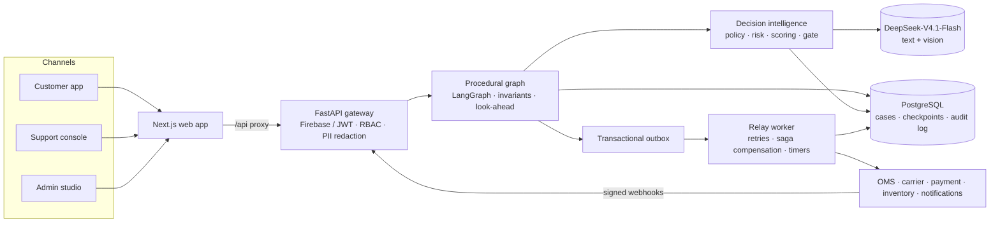

# Vapsi: Autonomous Product Return Resolution Agent

**Returns, resolved. Safely, autonomously, explainably.**

[](https://github.com/hari08varma/saferetuns/actions/workflows/ci.yml)


Vapsi resolves e-commerce returns end to end. It understands the customer in plain language,
retrieves the order, verifies eligibility against the return policy, checks photo evidence,
recommends the best resolution (refund, replacement, exchange, or keep-item refund) and
executes it: pickup, refund, replacement order and status updates until the case is closed.
Complex or high-risk cases are escalated to people, and consequential actions need human
approval.

> **The AI proposes, the code decides.** The language model understands and explains.
> Eligibility, amounts and permissions are decided by deterministic code, and every
> decision is recorded with the policy clause behind it.

---

## Contents

- [Why Vapsi](#why-vapsi)
- [Features](#features)
- [How it works](#how-it-works)
- [Architecture](#architecture)
- [Safety guarantees](#safety-guarantees)
- [Getting started](#getting-started)
- [Configuration](#configuration)
- [Deployment](#deployment)
- [Testing and evaluation](#testing-and-evaluation)
- [Project structure](#project-structure)
- [Roadmap](#roadmap)
- [Research](#research)
- [Team](#team)

---

## Why Vapsi

Every return is a decision. Is it eligible? Refund, replacement or exchange? Is the photo
genuine? Does a person need to approve it? Today those decisions are made in one of two ways:

| | Return portals (forms + fixed rules) | General AI support agents | **Vapsi** |
|---|---|---|---|
| Understands free-text requests, asks clarifying questions | No, form fields only | Yes | **Yes** |
| Who decides eligibility and amounts | Static rules, people for exceptions | The model, guided by a prompt | **Policy engine and refund calculator in code** |
| Explains the decision with the policy clause | Rarely | Can invent policy | **Always, from the clause trace** |
| Weighs options (exchange, keep-item, refund) by cost and risk | Fixed order | No | **Utility scoring per case** |
| Automated photo evidence checks | Manual review | No | **Forensics + vision assessment** |
| Risk-based autonomy (auto / approval / escalate) | No | Limited | **Confidence + risk gate, kill switch** |
| Safe execution (idempotent, never refunds twice) | Partly | Depends on integration | **Transactional outbox + invariants** |

Portals follow rules but can't understand. AI agents understand but can't be trusted with
policy and money. Vapsi does both.

---

## Features

**Customers**
- Phone sign-in (Firebase Phone Auth) and profile management
- Guided support assistant: chats about the customer's own orders, asks clarifying questions
  for incomplete requests, then opens the return; "talk to a person" escalates to the team
- Return requests with reason collection and photo evidence upload
- Return, replacement, refund and exchange workflows
- Return-status notifications, automated follow-ups and reminders
- Return history and an order-and-return timeline
- Request a human review of any decision

**AI agent**
- Return request understanding and reason classification (3-sample agreement)
- Order and product retrieval, eligibility verification, return-policy evaluation
- Product condition assessment from photos (vision model + image forensics)
- Resolution recommendations scored on revenue, cost, customer fit and risk
- Policy and decision explanations; every reply verified before it is sent

**Support team**
- Return dashboard with queues, claims, SLA timers and filters
- AI-generated case summaries and handoff packets, so nobody re-asks the customer
- Human approval with per-staff authority limits and a two-person rule above ₹25,000
- Exception and dispute handling, goodwill credits, QC inspection
- Analytics: return reasons, refund and return trends, resolution time, SLA breaches, and
  prevention insights (which products to fix, and why)

**Admin and trust**
- Policy and workflow configuration (versioned YAML policies, versioned graph, decision settings)
- Role-based access control: agent, approver, admin, QC operator, analyst
- Tamper-evident (hash-chained) audit trail of AI and user actions
- PII encrypted at rest and redacted before every model call

---

## How it works

A customer writes: *"My earbuds case arrived cracked. I want a new one."*

| Step | What Vapsi does |
|---|---|
| Understand | Reason: damaged. Wants: replacement. Matches the order. |
| Verify eligibility | Delivered 5 days ago, inside the window; the policy requires a photo. |
| Assess evidence | Crack visible; the photo is original, not reused, edited or AI-generated. |
| Recommend | Replacement in stock: highest-utility option. |
| Decide autonomy | Low risk, low value, high confidence: **auto**. Otherwise approval or escalation. |
| Execute and track | Pickup, replacement order, notifications and reminders until closed. |

Two core components make this safe.

### 1. Procedural graph: the fixed route

The return journey is a versioned JSON graph (`config/graphs/returns_v1.json`, 25 nodes)
compiled to LangGraph.

- The model chooses only among the transitions the graph allows; it cannot skip or invent steps.
- Hard invariants are checked in code before every transition (see [Safety guarantees](#safety-guarantees)).
- **Look-ahead**: an option is offered only if it can actually be completed (for example, no exchange when the size is out of stock).
- Waiting nodes pause for the customer, a carrier event or a human approval; Postgres checkpoints let a case resume exactly where it stopped, even after a restart.
- Each case is pinned to the graph version it started on.

### 2. Decision intelligence: Reason → Search → Infer → Explain

- **Reason**: the LLM extracts facts; the policy engine evaluates the legal layer (Consumer Protection (E-Commerce) Rules, 2020) and the merchant policy, and returns a clause trace.
- **Search**: every legal option is scored as `revenue − cost + customer fit − risk × exposure`. A keep-item refund wins when shipping the item back costs more than it can be resold for.
- **Infer**: confidence (the weakest input) and a rule-based risk score route the case to **auto**, **approval** or **escalate**. Admin-tunable thresholds are bounded by hard limits in code, and a kill switch turns automation off.
- **Explain**: a decision record is stored for every case, and each customer reply passes a deterministic check (amounts, placeholders, promises) and an LLM verifier before it is sent.

Risk signals are behavioural and evidence-based only (return ratio, serial damage claims,
duplicate or catalogue photos, linked accounts). There are no protected attributes, names or
locations, and evidence signals route a case to a person. Vapsi never auto-rejects on suspicion.

---

## Architecture



- **Side effects run only in the worker.** Graph nodes write intents to the outbox in the same
  transaction as the state change. The relay executes them with idempotency keys, exponential
  backoff and saga compensation (for example, a cancelled replacement after repeated failed pickups).
- **Approvals are single-use HMAC tokens** consumed by the relay, so an approved amount cannot be replayed or changed.
- **Webhooks** from the carrier and payment provider are HMAC-signed, replay-protected and de-duplicated.
- **Lifecycle timers** cover first response, grievance acknowledgement (48 hours) and resolution (30 days), the 7-day resolution target and refund turnaround.
- **External systems** sit behind adapter interfaces with mocks that support failure injection, so real providers can be swapped in without touching the agent.

---

## Safety guarantees

Enforced in code before every graph transition, regardless of what the model says:

| | Invariant |
|---|---|
| INV-1 | No order data or personal data before authentication |
| INV-2 | No offer or execution before eligibility passes |
| INV-3 | No execution when approval is required and not granted |
| INV-4 | Refund computed in code (integer paise) and never more than the amount paid |
| INV-5 | At most one refund per return |
| INV-6 | No commitment in a message beyond the decision record |
| INV-7 | A case cannot close as resolved without a successful execution |

Also built in:
- **Prompt-injection resistance.** Customer text is treated as data, tools are limited per step, and every reply is verified.
- **Privacy.** PII is redacted before every model call, encrypted with Fernet at rest, and looked up through blind indexes.
- **Accountability.** The audit log is hash-chained, so tampering is detectable.

---

## Getting started

### Prerequisites

- Docker and Docker Compose
- For local development: Python 3.11 with [uv](https://docs.astral.sh/uv/), and Node.js 20+

### Run with Docker

```bash
git clone https://github.com/hari08varma/saferetuns.git && cd saferetuns
cp .env.example services/.env          # fill in the secrets (generation commands are inside)
docker compose up -d --build           # Postgres, Redis, MinIO, API (:8000), worker
docker compose exec api python -m returns_agent.seed.admin --email owner@yourstore.in
```

On start-up the API runs migrations and an idempotent bootstrap: it loads the product
catalogue, creates the first admin when `BOOTSTRAP_ADMIN_EMAIL` and `BOOTSTRAP_ADMIN_PASSWORD`
are set, and gives every new account four standard demo orders to return.

API docs: <http://localhost:8000/docs>. Health check: <http://localhost:8000/healthz>.

### Local development

```bash
make install                                   # backend dependencies (uv)
docker compose up -d postgres redis minio      # infrastructure only
make migrate
make seed-db STAFF_PASSWORD='<12+ characters>' # catalogue, policies, demo staff
make seed-demo STAFF_PASSWORD='<same>'         # demo customers and orders (optional)
make api                                       # http://localhost:8000
make worker                                    # outbox relay and timers
make web                                       # installs web deps, http://localhost:3000
```

Without an LLM key, `LLM_PROVIDER=none` runs the whole flow with structured input and template
replies. Set `LLM_PROVIDER=deepseek` and `DEEPSEEK_API_KEY` for natural language and vision.

### Demo walkthrough

| Who | How to sign in |
|---|---|
| Staff | `agent@`, `approver@`, `admin@`, `qc_operator@`, `analyst@saferetuns.dev` (password from `seed-db`) |
| Priya | `+91 90000 00001`: instant refund, keep-item refund, final-sale decline, damaged item with photo, single and two-person approvals |
| Rahul | `+91 90000 00002`: heavy returner routed to fraud review |

Customer OTPs are shown on screen only when `DEV_OTP_ECHO=true` and Firebase is not configured
(development only). With a real setup, an admin creates test orders under **Admin → Test orders**.

---

## Configuration

Backend settings live in `services/.env` (template: [`.env.example`](.env.example)).

| Variable | Purpose |
|---|---|
| `DATABASE_URL` | PostgreSQL connection string |
| `JWT_SECRET` | Signs access and refresh tokens |
| `PII_ENCRYPTION_KEY`, `PII_INDEX_KEY` | Encryption at rest and blind indexes for personal data |
| `WEBHOOK_SECRET` | HMAC secret for carrier and payment webhooks |
| `LLM_PROVIDER`, `DEEPSEEK_API_KEY`, `LLM_MODEL` | `none` or `deepseek`; model `deepseek-flash` |
| `FIREBASE_PROJECT_ID` | Verifies customer phone sign-in tokens against Google's keys |
| `EVIDENCE_DIR` | Storage for uploaded evidence photos |
| `EMBEDDED_WORKER` | Run the relay inside the API process (single-container hosting) |
| `BOOTSTRAP_ADMIN_EMAIL`, `BOOTSTRAP_ADMIN_PASSWORD` | Create the first admin at start-up (hosts without a shell) |
| `DEV_OTP_ECHO` | Development only: show OTPs on screen |

Web settings live in `apps/web/.env.local` (template: [`apps/web/.env.example`](apps/web/.env.example)):
`API_URL` and the `NEXT_PUBLIC_FIREBASE_*` web app config.

Business behaviour is configuration, not code:

| File | What it controls |
|---|---|
| `config/policies/legal_in.yaml` | Legal layer (locked): Consumer Protection (E-Commerce) Rules, 2020 |
| `config/policies/merchant_*.yaml` | Merchant policy, versioned by effective date |
| `config/graphs/returns_v1.json` | The return journey: nodes, transitions, waiting points |
| `config/decision.yaml` | Scoring weights, costs, recovery rates, risk weights, gate thresholds, kill switch |
| `config/prompts/*.md` | Versioned prompts for understanding, replies, verification, evidence |

Secrets are never committed. `services/.env` and `apps/web/.env.local` are git-ignored.

---

## Deployment

- **Backend (Docker):** run `postgres`, `api` and `worker` from `docker-compose.yml` on any Docker host, behind HTTPS. The API runs migrations on start.
- **Web app (Vercel):** import the repo with root directory `apps/web`, then set `API_URL` and the Firebase variables. Vercel proxies `/api/*` to the backend, so no CORS setup is needed.
- **Firebase:** add the Vercel domain to the authorized domains, and restrict the web API key to it.

Step-by-step guide: [`docs/DEPLOY.md`](docs/DEPLOY.md).

---

## Testing and evaluation

```bash
make check       # ruff, mypy and the full test suite (about 500 tests)
make eval-smoke  # scripted eval suite, no model needed (runs in CI)
make eval-demo   # 20 key cases on the live model, small credit use
make eval-full   # full persona × case matrix, 4 trials, pass^k (large credit use)
```

- **Unit, property and integration tests** cover the policy engine, refund maths, graph invariants, the outbox and webhooks, evidence checks, approvals, RBAC and sign-in.
- **Evaluation harness.** Simulated customer personas run real conversations. Graders check the database end state, not the wording: right resolution, exact amount, no policy violation, no PII leak. Reliability is reported as pass^k, as in τ-bench.
- **Live-model result** (DeepSeek-V4.1-Flash, simulated data, 100 conversations): **90% passed, 0 policy violations, 100% exact refund amounts, 0 personal-data leaks.**

CI runs lint, format, type checks, tests and the smoke eval on every pull request.

---

## Project structure

```
apps/web/                 Next.js 15 app: customer, support console, admin, analytics
services/returns_agent/
  api/                    FastAPI app, auth, RBAC, routes
  graph/                  graph schema, compiler, invariants, look-ahead, nodes, runner
  decision/               risk, option scoring, autonomy gate, decision records
  policy/                 policy engine, refund calculator
  agent/                  understanding, order matching, replies, verifier, case service
  evidence/               intake, hashing, forensics, vision assessment, fusion
  hitl/                   queues, approvals, goodwill, handoff packets
  llm/                    provider client, PII redaction, prompts, metering
  workers/                outbox relay, timers
  adapters/               OMS, carrier, payment, inventory, notifications (+ mocks)
  analytics/              dashboard metrics and prevention insights
  audit/ security/ db/    audit chain, tokens and encryption, models
  evals/                  eval harness, personas, graders, reports
  seed/                   demo data, admin bootstrap
services/migrations/      Alembic migrations
services/tests/           test suite
config/                   graphs, policies, prompts, decision settings
docs/                     architecture, deployment, ADRs
```

---

## Roadmap

- **Recursive self-improvement.** Learn from escalations, disputes and human overrides. Reflect, propose prompt or threshold changes, replay them on the eval suite, and require admin approval before a new version goes live.
- **Production integrations.** Real OMS, carrier, payment and WhatsApp adapters behind the existing interfaces.
- **Storage.** Object storage (S3 or MinIO) for evidence in hosted deployments.
- **Languages.** Hindi and Telugu conversations.

---

## Research

| Area | Reference |
|---|---|
| Procedural graph | [STAGE: Stateful Translation to Agentic Graph Execution](https://arxiv.org/abs/2608.22538) (Luo et al., 2026) |
| Procedural graph | [Procedural Graphs: Self-Evolving Execution Structures for LLM Agents](https://arxiv.org/abs/2609.09153) (Lu et al., 2026) |
| Decision intelligence | [Self-Consistency Improves Chain of Thought Reasoning](https://arxiv.org/abs/2203.11171) (Wang et al., ICLR 2023) |
| Self-improvement | [Agentic Context Engineering (ACE)](https://arxiv.org/abs/2510.04618) (Zhang et al., 2025) |
| Self-improvement | [GEPA: Reflective Prompt Evolution](https://arxiv.org/abs/2507.19457) (Agrawal et al., ICLR 2026) |
| Evaluation | [τ-bench: Tool-Agent-User Interaction (pass^k)](https://arxiv.org/abs/2406.12045) (Yao et al., 2024) |

---

## Team

**InsideIntelligence**: P. Haranath · B. Shiva Sai · P. Nithin
